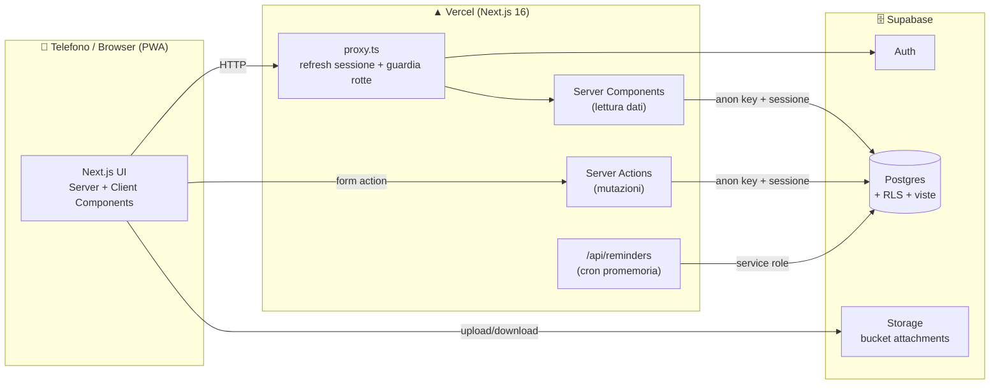
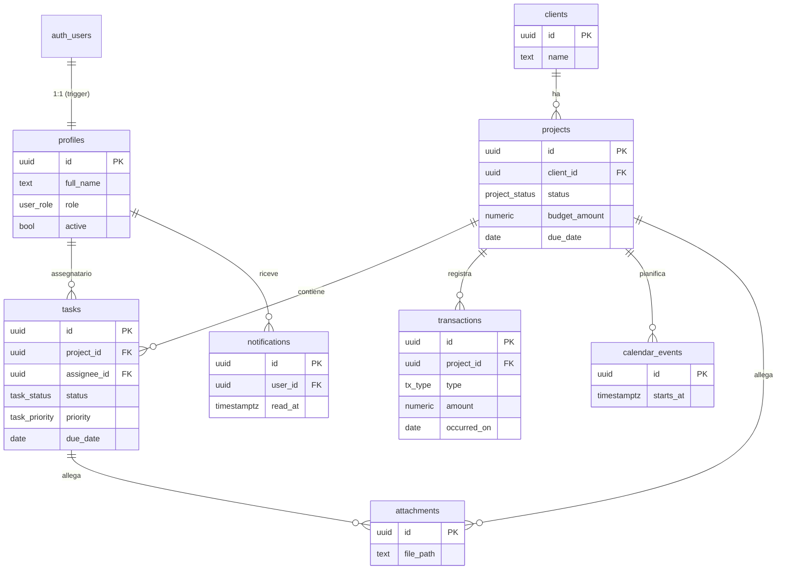
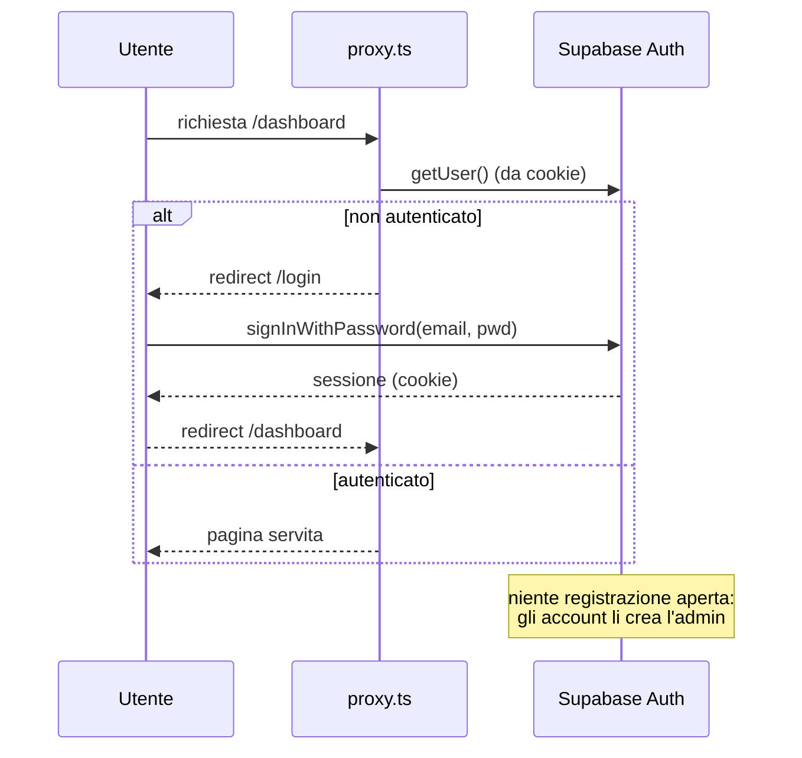
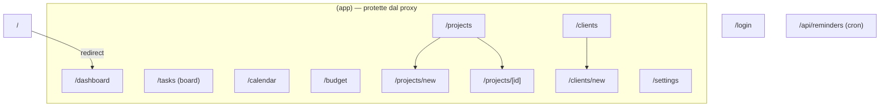
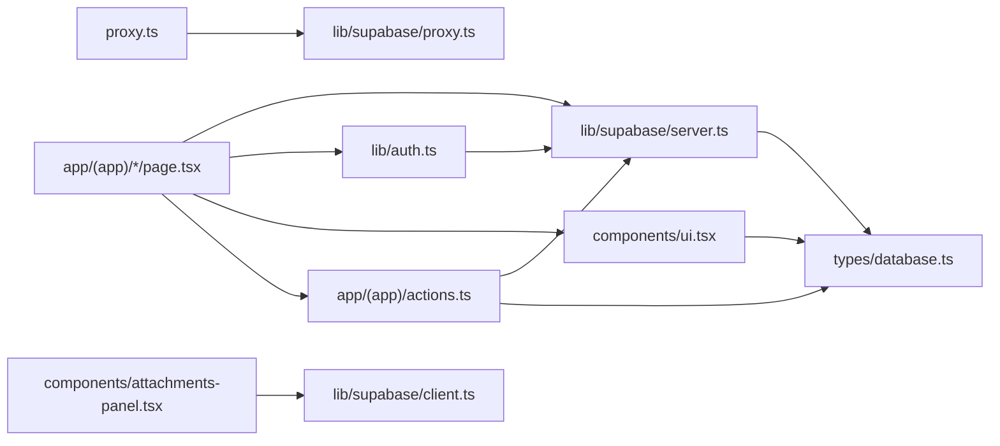

# Code Graph — T-Stack

Diagrammi dell'architettura, del modello dati e dei flussi principali (Mermaid).
GitHub li renderizza automaticamente.

## 1. Architettura

## 2. Modello dati (ER)

**Viste bilancio:** `project_financials` (entrate − uscite = margine per progetto) e
`monthly_income` (income/expense/net per mese).

## 3. Flusso autenticazione (solo-invito)

## 4. Flusso mutazione (Server Action)

```mermaid
flowchart LR
  Form["<form action={createTask}>"] --> SA["Server Action<br/>app/(app)/actions.ts"]
  SA --> Sup["createClient() server"]
  Sup --> RLS{"RLS:<br/>membro attivo?"}
  RLS -->|sì| DB[("INSERT/UPDATE")]
  RLS -->|no| Deny["errore / negato"]
  SA --> Rev["revalidatePath()"]
  Rev --> UI["UI aggiornata"]
```

## 5. Mappa delle rotte

## 6. Dipendenze tra moduli chiave

