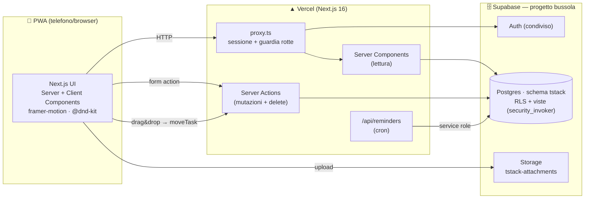
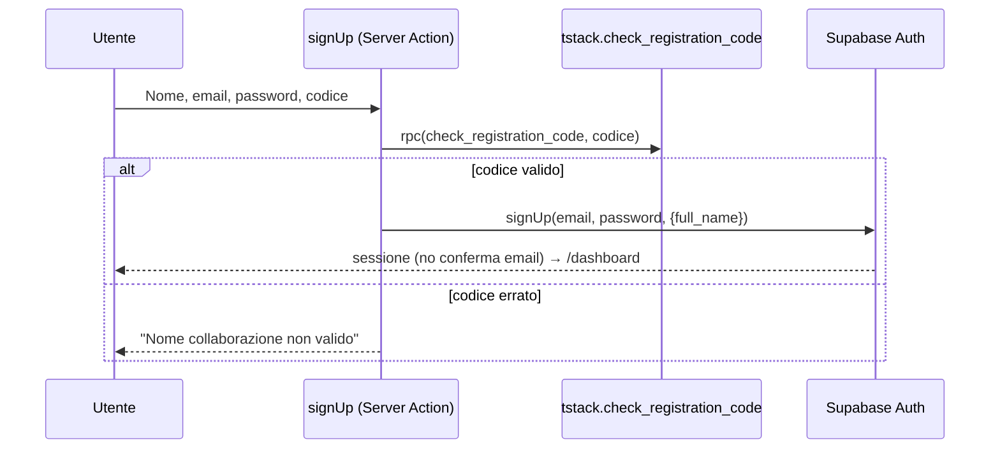
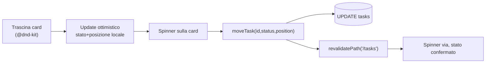
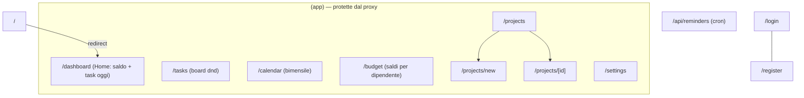

# Code Graph — T-Stack v2

Diagrammi dell'architettura, del modello dati e dei flussi (Mermaid).

## 1. Architettura



## 2. Modello dati (ER)

```mermaid
erDiagram
  profiles ||--o{ tasks : "assegnatario (assignee_id)"
  profiles ||--o{ transactions : "owner (saldo personale)"
  profiles ||--o{ notifications : riceve
  projects ||--o{ tasks : contiene
  projects ||--o{ attachments : allega
  projects ||--o{ calendar_events : pianifica
  auth_users ||--|| profiles : "1:1 (lazy al login)"
  app_settings }o--|| profiles : "codice gestito da admin"

  profiles { uuid id PK; text full_name; user_role role; bool active }
  projects { uuid id PK; project_status status; int priority_level; date due_date }
  tasks { uuid id PK; uuid project_id FK; uuid assignee_id FK; task_status status; int priority_level; int position; date due_date }
  transactions { uuid id PK; uuid owner_id FK; tx_type type; numeric amount; date occurred_on }
  calendar_events { uuid id PK; timestamptz starts_at }
  attachments { uuid id PK; text file_path }
  notifications { uuid id PK; uuid user_id FK; timestamptz read_at }
  app_settings { bool id PK; text registration_code }
```

**Vista bilancio:** `tstack.team_balances` (per dipendente: entrate − uscite = saldo, RLS-safe).

## 3. Registrazione con "nome collaborazione"



## 4. Meccanismo di stato dei task (drag & drop)



## 5. Mappa rotte


